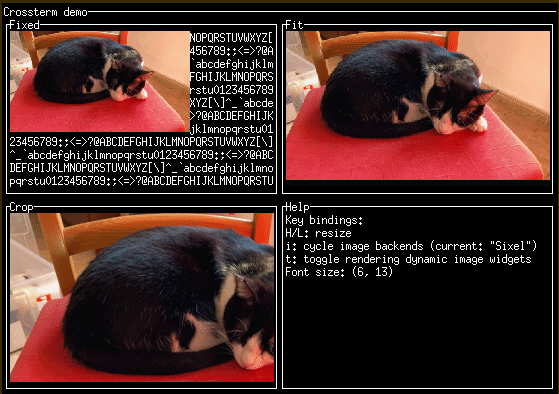

# Ratatu-image

**THIS CRATE IS EXPERIMENTAL!**

Render images with supported graphics protocols in the terminal with ratatui.
While this generally might seem *contra natura* and something fragile, it can be worthwhile in
some applications.



The images are always resized so that they fit their nearest rectangle in columns/rows.
The reason for this is because the image shall be drawn in the same "render pass" as all
surrounding text, and cells under the area of the image skip the draw on the ratatui buffer
level, so there is no way to "clear" previous drawn text. This would leave artifacts around the
image border.
For this resizing it is necessary to query the terminal font size in width/height.

The [`FixedImage`] widget does not react to area resizes other than not overdrawing. Note that
some image protocols or their implementations might not behave correctly in this aspect and
overdraw or flicker outside of the image area.

The [`ResizeImage`] stateful widget does react to area size changes by either resizing or
cropping itself. The state consists of the latest resized image. A resize (and encode) happens
every time the available area changes and either the image must be shrunk or it can grow. Thus,
this widget may have a much bigger performance impact.

Each widget is backed by a "backend" implementation of a given image protocol.

Currently supported backends/protocols:

## Halfblocks
Uses the unicode character `▀` combined with foreground and background color. Assumes that the
font aspect ratio is roughly 1:2. Should work in all terminals.
## Sixel
Experimental: uses temporary files.
Uses [`sixel-rs`] to draw image pixels, if the terminal [supports] the [Sixel] protocol.

[`sixel-rs`]: https://github.com/orhun/sixel-rs
[supports]: https://arewesixelyet.com
[Sixel]: https://en.wikipedia.org/wiki/Sixel

# Examples

For a more streamlined experience, see the [`crate::picker::Picker`] helper.

```rust
use image::{DynamicImage, ImageBuffer, Rgb};
use ratatui_imagine::{
    backend::{
        FixedBackend,
        halfblocks::FixedHalfblocks,
    },
    FixedImage, ImageSource, Resize,
};

let image: DynamicImage = ImageBuffer::<Rgb<u8>, Vec<u8>>::new(300, 200).into();

let source = ImageSource::new(image, (7, 14), None);

let static_image = Box::new(FixedHalfblocks::from_source(
    &source,
    Resize::Fit,
    source.desired,
)).unwrap();
assert_eq!(43, static_image.rect().width);
assert_eq!(15, static_image.rect().height);

let image_widget = FixedImage::new(&static_image);
```

